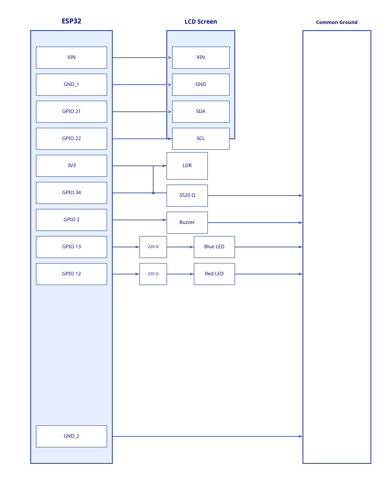
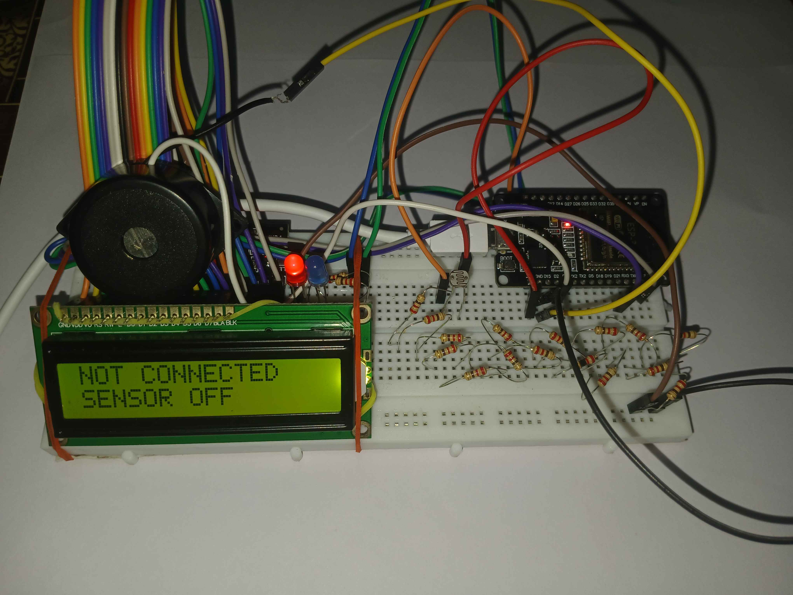
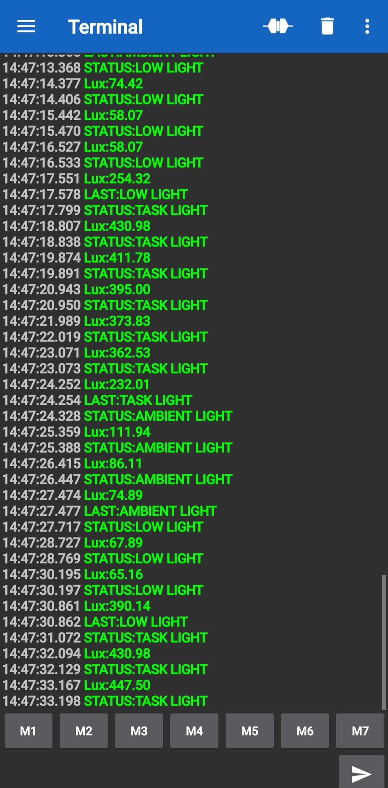

# ESP32-Lux-meter
ESP-32 based digital lux meter using LDR. Measures light in lux and sends real-time values and status of brightness to Bluetooth terminal app.

## FEATURES

- **Non-blocking operation**: Uses `millis()` instead of `delay()`, ensuring smooth operation of LDR, LCD, buzzer, LED, and Bluetooth at the same time.
- **Illuminance measurement**: LDR changes resistance according to light and it is converted to Lux value.
- **Live display**: I2C LCD shows real-time Lux value readings and status of light.
- **Alerts**: Active buzzer and LED's turn on when paired and unpaired.
- **Bluetooth telemetry**: Sends Lux value to a paired phone via Bluetooth for live monitoring.

## HARDWARE USED

- ESP32 DevKit
- LDR
- 3520 ohm resistor
- 16x2 I2C LCD Display (0x27 address)
- Active Buzzer
- Blue LED + 220 ohm resistor
- Red LED + 220 ohm resistor
- Breadboard and jumper wires

## TECH STACK

- Arduino framework / ESP-IDF
- BluetoothSerial.h
- LiquidCrystal_I2C library

## DEMO VIDEO

## PROJECT IMAGES

### CIRCUIT DIAGRAM

### HARDWARE SETUP

### SERIAL BLUETOOTH TERMINAL DATA

## AUTHOR

Febin Joshy | June 2026
